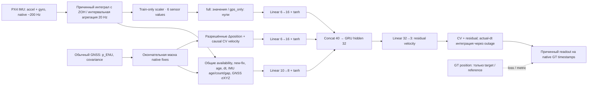

# FusionNav–INSANE — pilot architecture

Это компактная pilot architecture, не утверждение о доказанной новизне. Две модели обучаются с нуля; параметры и preprocessing Zurich не используются.

**7515 параметров в full и gps_only.** Одинаковы backbone, начальные веса seed0, non-IMU признаки, training episodes/order, augmentation, optimizer и validation-критерий. Только шесть normalized accel/gyro обнуляются у gps_only; IMU age/count/gap остаются общими. IMU не поворачивается через GT attitude; absolute position, RTK, onboard pose и магнитометр не входят в модель.

GRU state переносится через outage. Каждый независимый эпизод начинается с нулевого hidden state и 20s разрешённой истории, без GT-сбросов. При возвращении legal GNSS decoder возвращается к его координатам, GRU state сохраняется. Motion loss и primary metric действуют внутри outage; метрики также включают абсолютные ошибки и recovery.

Published PX4 stream `/mavros/imu/data_raw` содержит specific force в м/с² и gyro в rad/s, body ROS axes, а не world acceleration. Published GNSS ENU используется напрямую с одним общим GNSS-derived origin. Точные reference lat/lon взяты из закреплённого `extract_data.m`, а не округлённого README. Timestamp corrections к GT уже применены авторами. Калибровки других IMU/магнитометра не применяются к PX4 второй раз.

GT относится к PX4 IMU origin и получен авторами из dual RTK / magnetometer geometry. Плечо обычной GNSS-антенны отсутствует в выданной calibration: raw absolute comparison и динамическая составляющая relative comparison имеют это ограничение. GT quaternion не читается adapter-ом. Native GT строки используются без размножения на20Hz; только reference anchor интерполируется к last legal fix time. Предсказание в GT timestamp использует прошлый token и его velocity, без интерполяции из будущего.

15-state ESKF реализован отдельно и проверяется на покое, постоянной скорости, повороте, irregular dt, возврате GNSS/Joseph update и lever-arm measurement. **Real-data ESKF not_ready**: нет ordinary-GNSS lever arm и подтверждённой causal yaw initialization. Его параметры в config — только engineering defaults для synthetic tests, не flight calibration; недостоверные ESKF числа в сравнении не публикуются.
